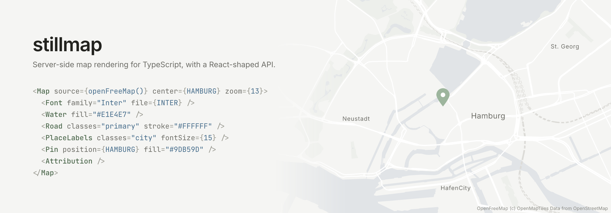

<p align="center">
  
</p>

Describe a map as JSX, get back an SVG string or a PNG buffer. No browser, no
canvas, no native map library, and no API key.

## Getting started

```sh
yarn add @stillmap/react @stillmap/sources react react-dom
```

PNG output goes through resvg, which is an optional peer. Skip it if SVG is
all you need.

```sh
yarn add @resvg/resvg-js
```

```tsx
import {
  Attribution,
  Font,
  Map,
  Pin,
  Road,
  Water,
  renderMap,
} from "@stillmap/react";
import { openFreeMap } from "@stillmap/sources";
import { writeFile } from "node:fs/promises";
import { fileURLToPath } from "node:url";

const HAMBURG = [9.9937, 53.5511] as const;
const INTER = fileURLToPath(new URL("./Inter.ttf", import.meta.url));

const { png } = await renderMap(
  <Map
    source={openFreeMap()}
    center={HAMBURG}
    zoom={13}
    width={1200}
    height={300}
    background="#F5F5F3"
  >
    <Font family="Inter" file={INTER} />
    <Water fill="#E1E4E7" />
    <Road classes={["secondary", "tertiary"]} stroke="#FFFFFF" width={2} />
    <Road classes={["motorway", "trunk"]} stroke="#FCFBF9" width={3.2} />
    <Pin position={HAMBURG} fill="#9DB59D" />
    <Attribution />
  </Map>,
  { format: "png", scale: 2 },
);

await writeFile("map.png", png);
```

A font is not optional for PNG. Every render carries attribution, and the
rasteriser loads no system fonts, so `renderMap` refuses rather than hand back
an image with the attribution missing. Fonts are passed as file paths; see
[fonts](./docs/fonts.md).

Nothing is styled by default. A layer you do not declare is not drawn, and a
layer you declare without a colour paints black, so the palette above is doing
real work rather than decorating.

## Why this exists

Putting a static map on a page usually means pointing an `` at a provider's
CDN. Every visitor then makes a request to that provider, which in some
countries turns a piece of decoration into a consent question, and which ties
the page to an API key and to a bill that grows with your traffic rather than
with the number of maps you actually have.

The data stopped being the obstacle a long time ago. OpenStreetMap is free to
use commercially, and several providers serve vector tiles built from it. What
was left was the rendering, and doing that yourself meant driving a headless
browser or binding a native map library. That is a lot of machinery for a map in
a footer.

stillmap renders in plain Node. Call it per request behind your own domain, or
call it once in a build step and keep the image for reuse. Either way the
browser only ever talks to you. `examples/nextjs` is the per-request shape, with
the caching that makes it affordable.

## Packages

| Package             | Description                                          |
| ------------------- | ---------------------------------------------------- |
| `@stillmap/core`    | Rendering engine. No React, no native dependency.    |
| `@stillmap/sources` | Tile sources and schema adapters.                    |
| `@stillmap/react`   | JSX declaration API and `renderMap()`.               |
| `stillmap`          | CLI. `stillmap dev` previews templates in a browser. |

## Documentation

- [Fonts](./docs/fonts.md)
- [Tile sources](./docs/tile-sources.md)
- [Previewing maps](./docs/preview.md)

## Status

Pre-release. The API is not stable.

## License

Apache-2.0
